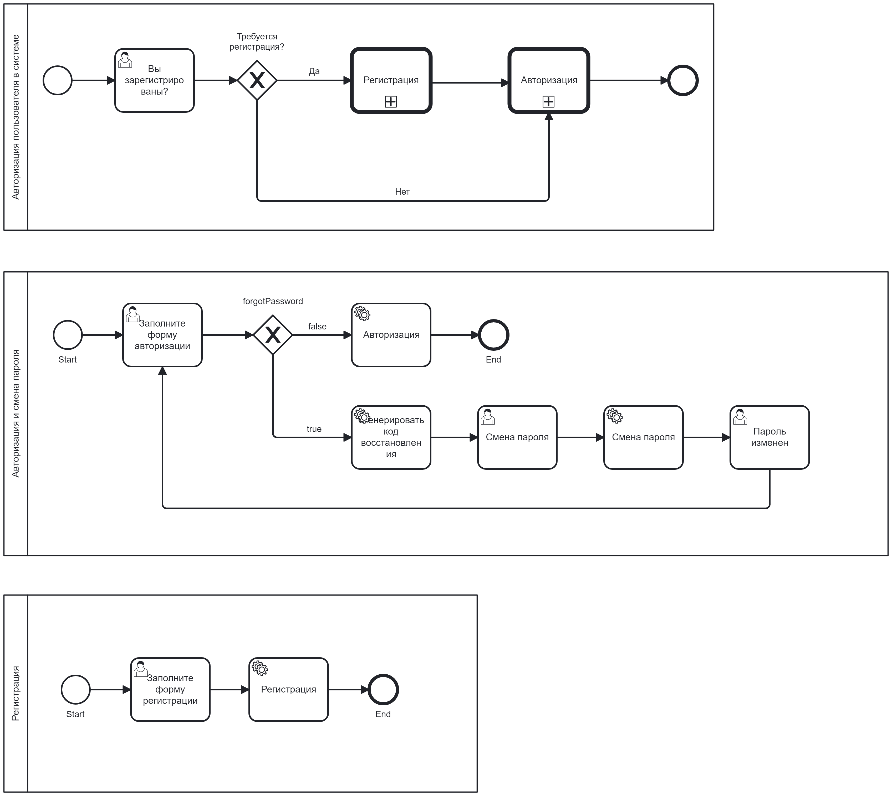
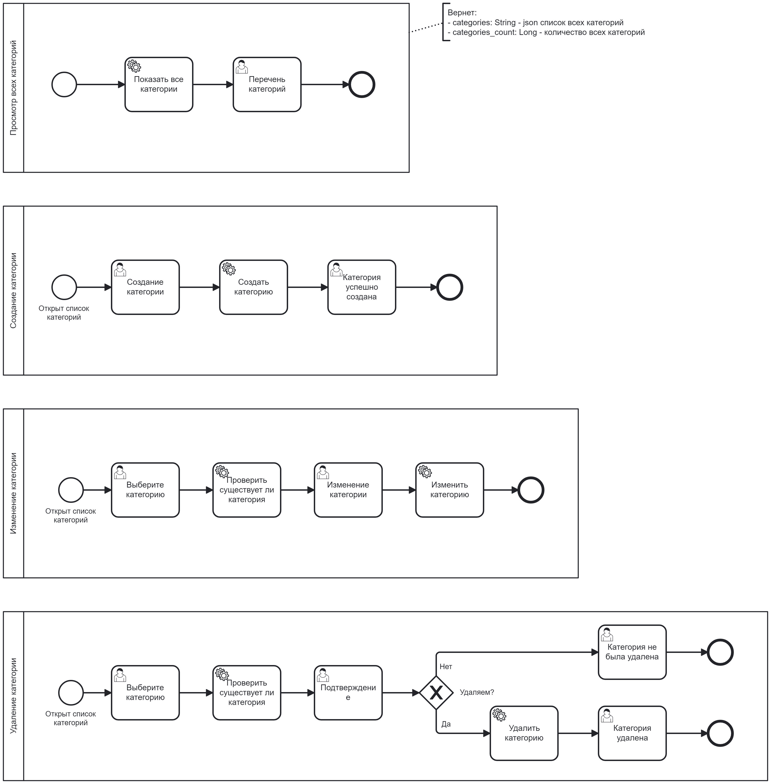
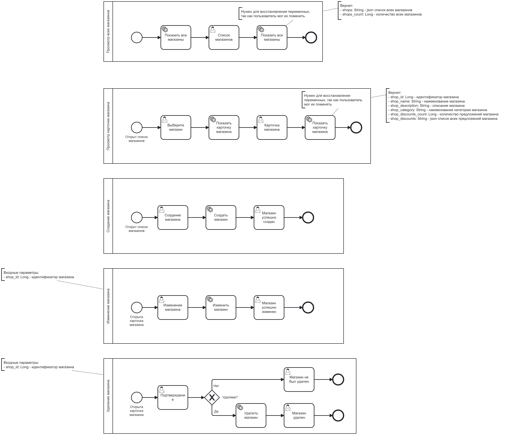
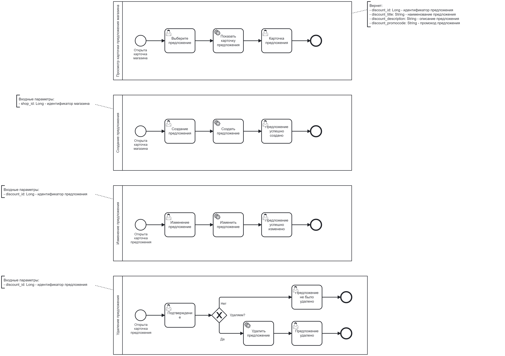
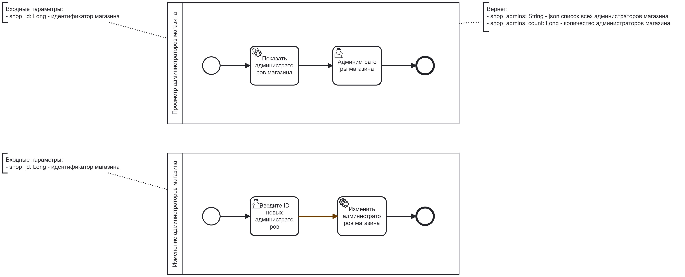
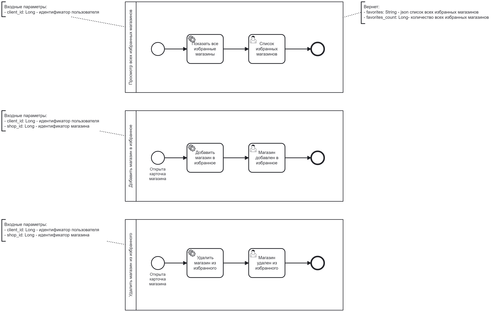
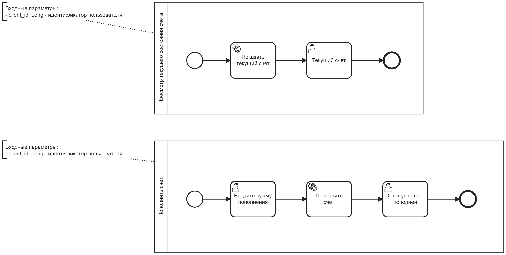
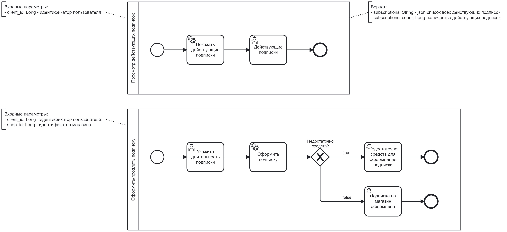

# 4 лабораторная работа по предмету "Бизнес логика программных систем"

## Авторы

- Калинин Даниил Дмитриевич P33141 - https://github.com/DanKalinin125
- Ушаков Максим Евгеньевич P33141 - https://github.com/dmeaaxd

## Общие сведения

Целью проекта является перенос всех функциональностей из 3 лабораторной работы на BPM-систему Camunda

Составляющие 3 лабораторной работы:

- Основной функционал с REST API - [BLPS_lab3_Monolit](https://github.com/dmeaaxd/BLPS_lab3_Monolit/tree/master)
- Сервис отправки почтовых нотификаций - [BLPS_lab3_NotificationService](https://github.com/dmeaaxd/BLPS_lab3_NotificationService)
- Сервис осуществления финансовых операций - [BLPS_lab3_PaymentService](https://github.com/dmeaaxd/BLPS_lab3_PaymentService)

Проект представляет собой агрегатор промокодов (предложений) из разных интернет-магазинов. За основу взят сайт https://letyshops.com/us

## Роли

- **Пользователь** - клиент приложения, основной целью которого является просмотр представленных магазинов и предложений (промокодов) каждого магазина
- **Системный администратор** - пользователь, основной задачей которого является администрирование агрегатора: управление списком категорий магазинов, создание и удаление магазинов, управление списком администраторов каждого магазина
- **Администратор магазина** -  администратор конкретного магазина, отвечает за редактирование магазина и управление предложениями конкретного магазина

## Функциональности

### Авторизация и регистрация

| Функциональность / Роль | Пользователь | Системный администратор | Администратор магазина |
|-------------------------|--------------|-------------------------|------------------------|
| Авторизация             | +            | +                       | +                      |
| Регистрация             | +            | +                       | +                      |
| Восстановление пароля   | +            | +                       | +                      |

### Категории магазинов

| Функциональность / Роль   | Пользователь | Системный администратор | Администратор магазина |
|---------------------------|--------------|-------------------------|------------------------|
| Просмотр списка категорий | +            | +                       | +                      |
| Создание категории        |              | +                       |                        |
| Редактирование категории  |              | +                       |                        |
| Удаление категории        |              | +                       |                        |

### Магазины

| Функциональность / Роль                                                  | Пользователь | Системный администратор | Администратор магазина |
|--------------------------------------------------------------------------|--------------|-------------------------|------------------------|
| Просмотр списка магазинов                                                | +            | +                       | +                      |
| Создание магазина                                                        |              | +                       |                        |
| Просмотр карточки магазина (Просмотр свойств и предложений магазина) | +            | +                       | +                      |
| Редактирование магазина                                                  |              |                         | +                      |
| Удаление магазина                                                        |              | +                       |                        |

### Администраторы магазинов

| Функциональность / Роль                                                  | Пользователь | Системный администратор | Администратор магазина |
|--------------------------------------------------------------------------|--------------|-------------------------|------------------------|
| Просмотр списка администраторов магазина                                 |              | +                       |                        |
| Редактирование списка администраторов магазина                           |              | +                       |                        |

### Предложения магазина

| Функциональность / Роль              | Пользователь | Системный администратор | Администратор магазина |
|--------------------------------------|--------------|-------------------------|------------------------|
| Создание предложения                 |              |                         | +                      |
| Просмотр карточки предложения        | +            | +                       | +                      |
| Редактирование предложения           |              |                         | +                      |
| Удаление предложения                 |              |                         | +                      |

### Избранное

**Избранное** - возможность пользователей сохранить магазин в личную подборку для более быстрого обращения к нему

| Функциональность / Роль             | Пользователь | Системный администратор | Администратор магазина |
|-------------------------------------|--------------|-------------------------|------------------------|
| Просмотр списка избранных магазинов | +            | +                       | +                      |
| Добавление магазина в избранное     | +            | +                       | +                      |
| Удаление магазина из избранного     | +            | +                       | +                      |

### Подписки

**Подписка** - платная возможность получения уведомлений о новых предложениях магазина

| Функциональность / Роль           | Пользователь | Системный администратор | Администратор магазина |
|-----------------------------------|--------------|-------------------------|------------------------|
| Просмотр списка активных подписок | +            | +                       | +                      |
| Оформление подписки на магазин    | +            | +                       | +                      |
| Продление подписки на магазин     | +            | +                       | +                      |

### Управление локальным счетом

Локальный счет - финансовый счет пользователя в системе, измеряется в у.е.

| Функциональность / Роль       | Пользователь | Системный администратор | Администратор магазина |
|-------------------------------|--------------|-------------------------|------------------------|
| Просмотр состояния счета      | +            | +                       | +                      |
| Пополнение счета              | +            | +                       | +                      |

## Бизнес-процессы

### BPMN 3 лабораторной работы

BPMN представляет собой громоздкую структуру, поэтому представлен единым файлом, открывается на сайте или программой draw.io

[BPMN 3 лабораторной работы](documents/BPMN.drawio)

### BPMN 4 лабораторной работы

#### BPMN Основной процесс

#### BPMN Clients

#### BPMN Categories

#### BPMN Shops

#### BPMN Discounts

#### BPMN Shop's admins

#### BPMN Favorites

#### BPMN Payments

#### BPMN Subscriptions

